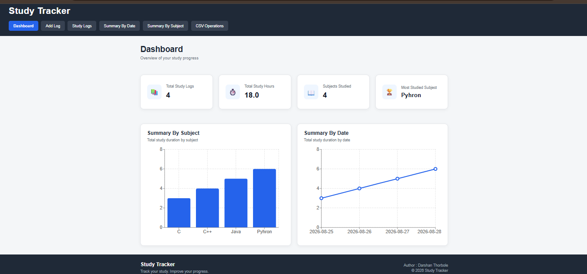
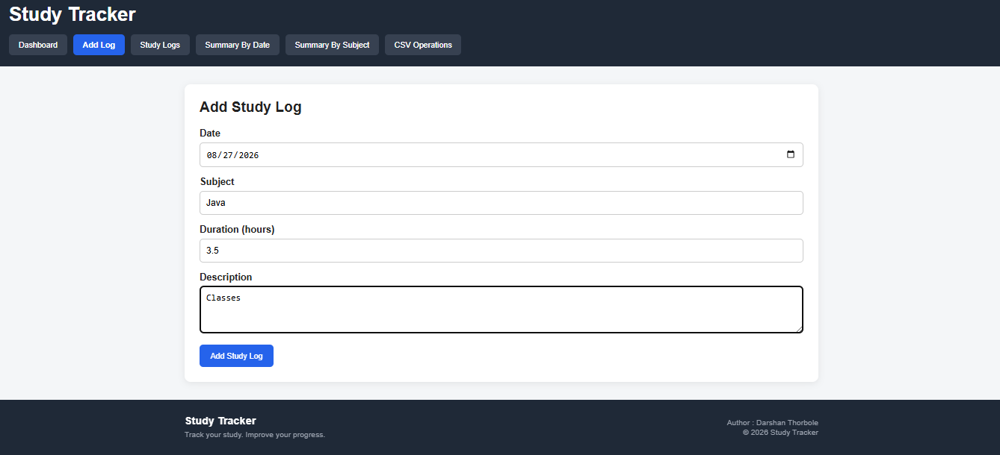
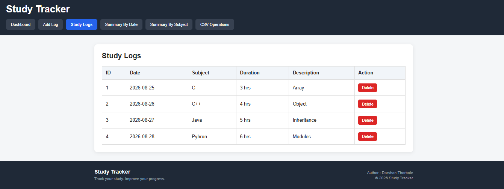
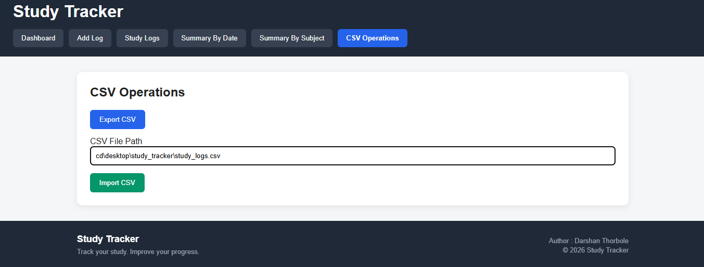

# Study Tracker

A full-stack web application for recording, managing, and analyzing study sessions — built with **React** on the frontend and **Spring Boot** on the backend.

Study Tracker lets you log daily study sessions, track total study time, analyze patterns by subject and date, visualize progress with charts, and import/export your data as CSV files. It uses **file-based persistence (CSV storage)**, so there's no external database to set up.

---

## Table of Contents

- [Features](#features)
- [Tech Stack](#tech-stack)
- [Project Structure](#project-structure)
- [Getting Started](#getting-started)
  - [Prerequisites](#prerequisites)
  - [Backend Setup](#backend-setup)
  - [Frontend Setup](#frontend-setup)
- [Usage](#usage)
- [Data Persistence](#data-persistence)
- [Screenshots](#screenshots)
- [Contributing](#contributing)
- [License](#license)

---

## Features

### 📊 Dashboard
- Total number of study logs
- Total study hours
- Total number of subjects
- Most studied subject
- Latest study date
- Subject-wise study progress
- Study insights
- Summary-by-Subject chart
- Summary-by-Date chart
- Quick access to add a new study log

### 📝 Study Log Management
- Add study logs
- View all study logs
- Delete study logs
- Automatic dashboard refresh after data changes

Each study log contains:
- **Date**
- **Subject**
- **Duration**
- **Description**

### 📈 Study Analysis
- **Summary by Subject** — total study duration per subject
- **Summary by Date** — total study duration per date

### 🔁 CSV Operations
- Import study logs from CSV files
- Export study logs to CSV files
- Duplicate-record prevention during import

### 💾 Automatic Data Persistence
Study data is stored locally and automatically in:
```
study_tracker_data.csv
```

---

## Tech Stack

**Backend**
- Java 17
- Spring Boot 4.1.1
- Spring Boot Starter Web MVC
- Spring Boot Starter Validation
- Maven (with Maven Wrapper)

**Frontend**
- React

**Persistence**
- CSV file storage (no external database required)

---

## Project Structure

```
Study_Tracker/
├── .mvn/wrapper/     # Maven wrapper files
├── frontend/         # React frontend application
├── screenshots/       # App screenshots
├── src/              # Spring Boot backend source
├── mvnw / mvnw.cmd    # Maven wrapper scripts
├── pom.xml           # Maven project configuration
└── README.md
```

---

## Getting Started

### Prerequisites

Make sure you have the following installed:

- **Java 17** or later
- **Node.js** and **npm** (for the React frontend)
- Maven is not required separately — the project includes the Maven Wrapper (`mvnw`)

### Backend Setup

1. Clone the repository:
   ```bash
   git clone https://github.com/thorboledarshan/Study_Tracker.git
   cd Study_Tracker
   ```

2. Run the Spring Boot backend using the Maven wrapper:
   ```bash
   # On Linux/macOS
   ./mvnw spring-boot:run

   # On Windows
   mvnw.cmd spring-boot:run
   ```

3. The backend server should start on its configured port (default Spring Boot port is `8080`).

### Frontend Setup

1. Navigate to the frontend directory:
   ```bash
   cd frontend
   ```

2. Install dependencies:
   ```bash
   npm install
   ```

3. Start the development server:
   ```bash
   npm start
   ```

4. Open your browser at `http://localhost:3000` (or the port shown in your terminal).

---

## Usage

1. Start both the backend and frontend servers as described above.
2. Open the app in your browser.
3. Use the dashboard to get an overview of your study activity.
4. Add new study logs (date, subject, duration, description) as you complete study sessions.
5. View, analyze, or delete existing logs.
6. Import or export your study data via CSV whenever needed.

---

## Data Persistence

Study Tracker doesn't require a database. All study log data is automatically read from and written to a local CSV file:

```
study_tracker_data.csv
```

This keeps setup simple — just clone, run, and your data persists between sessions in that file.

---

## Screenshots

### Dashboard
Overview of total logs, study hours, subjects, most-studied subject, and charts summarizing study time by subject and by date.



### Add Study Log
Form for logging a new study session with date, subject, duration, and description.



### Study Logs
List view of all recorded study logs.



### CSV Operations
Import and export study logs via CSV files.



---

## Contributing

Contributions are welcome! If you'd like to improve Study Tracker:

1. Fork the repository
2. Create a new branch (`git checkout -b feature/your-feature`)
3. Commit your changes (`git commit -m "Add your feature"`)
4. Push to the branch (`git push origin feature/your-feature`)
5. Open a Pull Request

---

## License

No license has been specified for this repository yet. Consider adding one (e.g., MIT) to clarify how others can use this project.